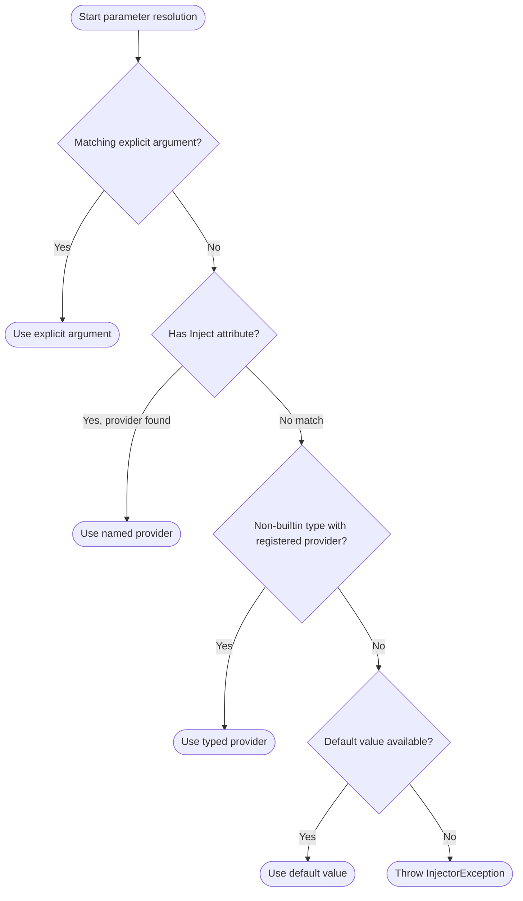
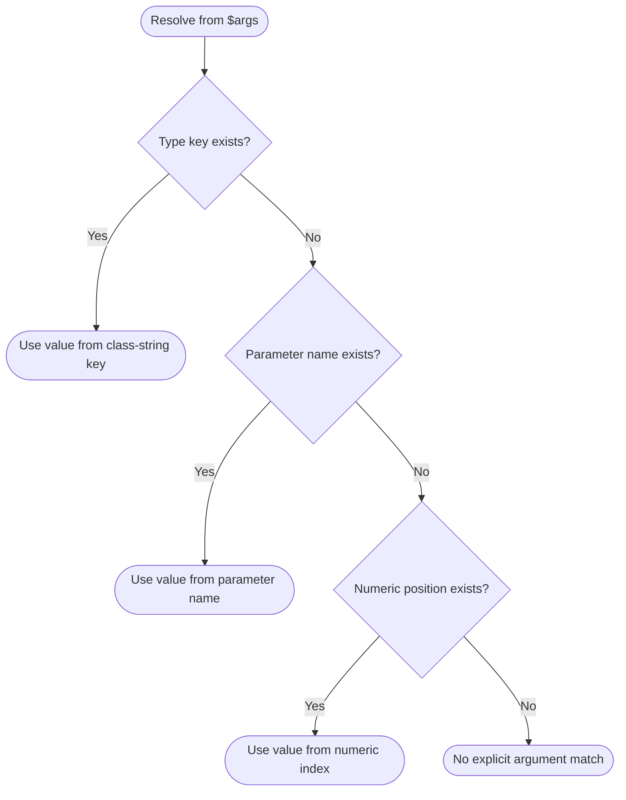

# PHPInjector

[](https://github.com/dvictorjhg/php-injector/actions/workflows/ci.yml)
[](https://codecov.io/gh/dvictorjhg/php-injector)

PHPInjector is a small reflection-based dependency injection package for modern PHP. It gives you a PSR-11 compatible container, a lightweight injector, a parameter attribute for explicit value binding, and a self-managed singleton contract without forcing a large framework around your code.

PHPInjector exists for projects that want constructor and method injection without adopting a full application container, a framework-specific service graph, or a code-generation step. The package stays close to native PHP features such as reflection, attributes, and simple arrays so it remains easy to read, debug, and embed in small or medium-sized codebases.

## Documentation

The [PHPInjector documentation page](docs/index.html) is the visual entry point for installation, common injection targets, provider lifecycles, parameter resolution, and the public API. It is self-contained and ready to publish through GitHub Pages from the repository's `/docs` directory. It defaults to the `en_US` locale and light theme; both preferences can be changed from the header and persist in the browser. This README remains the copy-and-paste reference for the full examples.

## Why Use PHPInjector

- Small surface area and low ceremony.
- Works with classes, methods, closures, invokable objects, global functions, and callable strings.
- Supports PSR-11 container access for simple provider storage.
- Allows lazy class registration, concrete instances, alias-style mappings, and named scalar values.
- Supports scalar or contextual values through explicit arguments or `#[Inject]`.
- Supports parent injector fallback for provider composition.
- Supports singleton-style providers through a dedicated contract.
- Uses implicit singleton caching by default, with a class-level `#[Transient]` attribute for opt-in transient resolution.
- Provides `Injector::inject()` and `PHPInjector\DI\inject()` global entry points backed by the active injector staircase.

## Requirements

- PHP 8.4+
- Composer

## Installation

Install the package:

```bash
composer require dvictorjhg/php-injector
```

## Quick Start

The examples below stay in the same small reporting domain and add one feature at a time.

### Example #1 Resolve a class with constructor injection

```php
<?php

declare(strict_types=1);

use PHPInjector\DI\Injector;

final class Logger
{
    public function log(string $message): string
    {
        return "[app] {$message}";
    }
}

final class ReportService
{
    public function __construct(private Logger $logger)
    {
    }

    public function generate(): string
    {
        return $this->logger->log('quarterly-report');
    }
}

$injector = new Injector([
    Logger::class,
]);

$service = Injector::inject(ReportService::class);

echo $service->generate();
```

The above example will output:

```text
[app] quarterly-report
```

`Injector::inject()` and `PHPInjector\DI\inject()` use the most recently constructed injector. If no injector exists yet, the first call creates a default injector. When a new `Injector` is created without an explicit parent, the previously active injector becomes its parent, forming a provider staircase.

For the function form, import it once with `use function PHPInjector\DI\inject;` and call `inject(...)` after creating the application's first injector.

## Usage

### Example #2 Register providers in the common forms

You can register a lazy class, an alias mapping, a prebuilt object, and a named scalar value in one injector:

```php
<?php

declare(strict_types=1);

use PHPInjector\DI\Injector;

interface Formatter
{
    public function format(string $value): string;
}

final class HtmlFormatter implements Formatter
{
    public function format(string $value): string
    {
        return "<report>{$value}</report>";
    }
}

final class Logger
{
}

final class RequestContext
{
    public function __construct(public string $source)
    {
    }
}

$injector = new Injector([
    Logger::class,
    Formatter::class => HtmlFormatter::class,
    RequestContext::class => new RequestContext('cli'),
    'env' => 'production',
]);

$firstLogger = Injector::inject(Logger::class);
$secondLogger = Injector::inject(Logger::class);
$formatter = Injector::inject(Formatter::class);
$context = Injector::inject(RequestContext::class);

var_dump($firstLogger === $secondLogger);
echo $formatter->format($context->source . ':' . Injector::inject('env'));
```

The above example will output:

```text
bool(true)
<report>cli:production</report>
```

Class-string providers and alias mappings are instantiated lazily and cached after first resolution unless the resolved class uses `#[Transient]`. Aliases and direct class resolution share the cached instance for the same automatically resolved concrete class.

### Example #3 Inject methods and other callables

PHPInjector can resolve more than constructors. The next example uses an instance method, a closure, a global function, and a callable string:

```php
<?php

declare(strict_types=1);

use PHPInjector\DI\Injector;

final class Logger
{
    public function __construct(public string $channel = 'app')
    {
    }
}
final class ReportController
{
    public function __construct(private Logger $logger)
    {
    }

    public function show(string $name): string
    {
        return "{$name} via {$this->logger->channel}";
    }
}

final class ReportJobs
{
    public static function warm(Logger $logger): string
    {
        return "warming {$logger->channel}";
    }
}

$injector = new Injector([
    Logger::class,
]);

echo Injector::inject([ReportController::class, 'show'], ['name' => 'sales']) . PHP_EOL;
echo Injector::inject(static fn (Logger $logger): string => "closure: {$logger->channel}") . PHP_EOL;
echo Injector::inject('strlen', ['string' => 'cache']) . PHP_EOL;
echo Injector::inject('ReportJobs::warm');
```

The above example will output:

```text
sales via app
closure: app
5
warming app
```

Callables can be provided as closures, array callables, callable strings, global function names, or first-class callables.

### Example #4 Bind scalar values explicitly

Scalar values can be passed directly per call when no provider should supply them:

```php
<?php

declare(strict_types=1);

use PHPInjector\DI\Injector;

final class ReportLabel
{
    public static function build(string $name, bool $formal = false): string
    {
        return $formal ? "Report: {$name}" : $name;
    }
}

$injector = new Injector();

echo Injector::inject([ReportLabel::class, 'build'], [
    'name' => 'Quarterly Sales',
    'formal' => true,
]);
```

The above example will output:

```text
Report: Quarterly Sales
```

Use one argument style per call. The injector accepts values by type key, parameter name, or numeric position, but it rejects mixed-key arrays.

### Example #5 Use `#[Inject]` for named values

When a scalar or context value should come from the injector, bind it explicitly with the attribute:

```php
<?php

declare(strict_types=1);

use PHPInjector\DI\Attributes\Inject;
use PHPInjector\DI\Injector;

final class Logger
{
    public function __construct(public string $channel = 'app')
    {
    }
}

final class ReportService
{
    public function __construct(
        private Logger $logger,
        #[Inject('env')] private string $environment,
    ) {
    }

    public function describe(): string
    {
        return "{$this->logger->channel}:{$this->environment}";
    }
}

$injector = new Injector([
    Logger::class,
    'env' => 'production',
]);

echo Injector::inject(ReportService::class)->describe();
```

The above example will output:

```text
app:production
```

### Example #6 Use the Singleton contract for self-managed providers

If a provider implements `PHPInjector\Contracts\Singleton`, the injector calls `getInstance()` instead of the constructor:

```php
<?php

declare(strict_types=1);

use PHPInjector\Contracts\Singleton;
use PHPInjector\DI\Injector;

final class ConfigRepository implements Singleton
{
    private static ?self $instance = null;

    public string $name = 'main';

    private function __construct()
    {
    }

    public static function getInstance(): self
    {
        return self::$instance ??= new self();
    }
}

$injector = new Injector([
    ConfigRepository::class,
]);

$first = Injector::inject(ConfigRepository::class);
$second = Injector::inject(ConfigRepository::class);

var_dump($first === $second);
echo $first->name;
```

The above example will output:

```text
bool(true)
main
```

The `Singleton` contract is appropriate when a class must own its creation policy. In this example, the private constructor and `getInstance()` implementation enforce uniqueness independently of injector-managed caching.

### Example #7 Opt into transient resolution with `#[Transient]`

Classes use injector-managed singleton caching by default. Add `#[Transient]` to skip that automatic cache and receive a fresh instance whenever resolution reaches the class constructor:

```php
<?php

declare(strict_types=1);

use PHPInjector\DI\Injector;

use PHPInjector\DI\Attributes\Transient;

#[Transient]
final class ConnectionPool
{
    public readonly string $id;

    public function __construct()
    {
        $this->id = uniqid('conn-');
    }
}

$injector = new Injector();

$first = Injector::inject(ConnectionPool::class);
$second = Injector::inject(ConnectionPool::class);

var_dump($first === $second);
var_dump($first->id === $second->id);
```

The above example will output:

```text
bool(false)
bool(false)
```

Unlike the `Singleton` contract, the `#[Transient]` attribute is an injector-managed opt-out from the default cache. Each injector has its own local cache, while a newly constructed injector can fall back through the active injector staircase.

The attribute does not override an explicitly supplied provider object or a class's `Singleton::getInstance()` implementation. Static injection always uses the most recently constructed injector.

### Example #8 Compose providers with a parent injector

A child injector checks its own providers first and then falls back through its parent chain:

```php
<?php

declare(strict_types=1);

use PHPInjector\DI\Injector;

final class Logger
{
    public function log(string $message): string
    {
        return "[app] {$message}";
    }
}

final class ReportService
{
    public function __construct(private Logger $logger)
    {
    }

    public function generate(): string
    {
        return $this->logger->log('child-report');
    }
}

$parent = new Injector([
    Logger::class,
]);
$child = new Injector();

$service = Injector::inject(ReportService::class);
echo $service->generate();
```

The above example will output:

```text
[app] child-report
```

The child owns the automatically constructed `ReportService`; its `Logger` dependency is found through the parent provider chain.

### Example #9 Inject a closure and a variadic list

Named non-builtin types can use providers keyed by their type. A `Closure` provider can be selected by `Closure::class`, and an array-valued provider is expanded for a variadic parameter:

```php
<?php

declare(strict_types=1);

use PHPInjector\DI\Injector;

final class Logger
{
    public function __construct(public string $channel)
    {
    }
}

final class ReportBatch
{
    public static function channels(Logger ...$loggers): string
    {
        return implode(',', array_map(
            static fn (Logger $logger): string => $logger->channel,
            $loggers,
        ));
    }
}

$format = static fn (string $value): string => strtoupper($value);

$injector = new Injector([
    \Closure::class => $format,
    Logger::class => [
        new Logger('api'),
        new Logger('worker'),
    ],
]);

$formatted = Injector::inject(
    static fn (\Closure $format): string => $format('ready'),
);
$channels = Injector::inject([ReportBatch::class, 'channels']);

echo $formatted . PHP_EOL;
echo $channels;
```

The above example will output:

```text
READY
api,worker
```

### Resolution order

For each parameter, PHPInjector walks a fixed lookup chain and stops at the first match.

1. Explicit per-call arguments.
2. `#[Inject('id')]` attribute lookup.
3. Registered provider lookup for a non-builtin parameter type.
4. PHP default parameter value.
5. Exception if nothing matches.

The important detail is that step 1 has its own internal precedence. When you pass `$args`, PHPInjector checks them in this order for each parameter:

1. Type key, for example `Logger::class => $logger`.
2. Parameter name, for example `'logger' => $logger`.
3. Numeric position, for example `[0 => $logger]`.

Use one argument style per call. Mixed-key arrays such as `[Logger::class => $logger, 0 => $fallback]` are rejected.

When step 3 runs, provider lookup checks the active injector first and then walks up the parent injector staircase until a matching provider is found or the chain ends. Passing an explicit parent to the constructor overrides the automatic parent selection.

Automatic type-based lookup supports registered non-builtin named types, including concrete classes, interfaces, abstract classes, enum instances, nullable named types, and `Closure` providers registered under `Closure::class`. Built-in types, `callable`, untyped parameters, and union, intersection, or DNF types require an explicit value in `$args`, a named provider through `#[Inject('id')]`, or a PHP default. The injector does not choose between multiple compound-type candidates automatically.

Variadic parameters accept zero or more values. Positional values from the variadic parameter's position onward are expanded, and an array-valued provider is expanded into individual arguments.

#### Parameter resolution flow



#### Explicit argument precedence



#### Example

```php
<?php

declare(strict_types=1);

use PHPInjector\DI\Attributes\Inject;
use PHPInjector\DI\Injector;

final class Logger
{
    public function __construct(public string $channel = 'app')
    {
    }
}

final class ReportRunner
{
    public function run(
        Logger $logger,
        #[Inject('env')] string $environment,
        string $report = 'summary',
    ): string {
        return "{$logger->channel}:{$environment}:{$report}";
    }
}

$injector = new Injector([
    Logger::class,
    'env' => 'production',
]);

echo Injector::inject([ReportRunner::class, 'run'], [
    'report' => 'sales',
]);
```

The above example will output:

```text
app:production:sales
```

In that call:

1. `Logger $logger` is resolved from the typed provider lookup.
2. `#[Inject('env')] string $environment` is resolved from the named provider.
3. `string $report` is resolved from the explicit per-call argument.

## Container Support

The package includes `PHPInjector\Container\Container`, a PSR-11 compatible container for direct storage and retrieval of providers. It is intentionally small and can also be used without the injector when all you need is provider registration and lookup.

## Quality

The main CI workflow in [.github/workflows/ci.yml](.github/workflows/ci.yml) uses [GitHub Actions](https://github.com/features/actions) on PHP 8.4 and 8.5 to validate [Composer](https://getcomposer.org/) metadata, run [PHPStan](https://phpstan.org/) static analysis, execute the [PHPUnit](https://phpunit.de/) suite with [Xdebug](https://xdebug.org/) coverage enabled, publish the Clover report to [Codecov](https://codecov.io/gh/dvictorjhg/php-injector), and fail the build if statement coverage drops below 80%.

Before the first upload, enable the repository in Codecov. Public pull requests from forks can upload from an unprotected branch without a token, but uploads for protected branches and all private repositories require a Codecov token unless token authentication for public repositories has been disabled in Codecov's **Global Upload Token** settings. For the reliable protected-branch path, add the repository token as a GitHub Actions secret named `CODECOV_TOKEN` under **Settings > Secrets and variables > Actions**. Keep it in GitHub Secrets rather than committing it to the repository. If the repository is private, copy the tokenized badge URL from Codecov's **Badges & Graphs** settings and replace the badge image URL above.

## Tooling

- [GitHub Actions](https://github.com/features/actions) for continuous integration, with [actions/checkout](https://github.com/actions/checkout) to fetch the repository and [shivammathur/setup-php](https://github.com/shivammathur/setup-php) to provision supported PHP runtimes with Xdebug coverage support.
- [Codecov](https://codecov.io/gh/dvictorjhg/php-injector) for the coverage report and README badge, uploaded through [codecov/codecov-action](https://github.com/codecov/codecov-action) with tokenless public-branch support and a GitHub Actions secret for protected-branch uploads.
- [Composer](https://getcomposer.org/) for dependency management, package metadata validation, dependency installation, and project scripts such as `composer analyse`, `composer test`, and `composer test:coverage`.
- [PHPStan](https://phpstan.org/) for static analysis, executed through `composer analyse`.
- [PHPUnit](https://phpunit.de/) for the unit test suite and Clover coverage report generation through `composer test:coverage`.
- [Xdebug](https://xdebug.org/) for code coverage in CI and local coverage runs.
- [tools/check-coverage.php](tools/check-coverage.php) for enforcing the minimum 80% statement coverage threshold from the generated Clover XML.

## Local Development

Install dependencies and run the test suite:

```bash
composer install
composer analyse
composer test
```

To run the same coverage checks enforced in CI:

```bash
composer test:coverage
composer coverage:check
```

## Contributing

Contributions are welcome. Start with [CONTRIBUTING.md](CONTRIBUTING.md) for setup, test expectations, and pull request guidance.

GitHub issue forms and a pull request template are included to keep reports and reviews consistent.

## Security

Please report vulnerabilities privately as described in [SECURITY.md](SECURITY.md).

## Changelog

Release notes for the first public release and future unreleased changes live in [CHANGELOG.md](CHANGELOG.md).

## Release / Publishing

For a release, update [CHANGELOG.md](CHANGELOG.md), validate the package with `composer validate --strict`, `composer analyse`, and `composer test`, then create and push an annotated Git tag such as `1.0.0`.

After the tag is on GitHub, publish a GitHub Release for that tag and make sure the repository is public. Packagist reads versions from Git tags, so submit or refresh the repository at Packagist and verify that users can install the package with `composer require dvictorjhg/php-injector:^1.0`.

## License And Attribution

This project is licensed under Apache-2.0. That keeps the project open-source while requiring preservation of the license text, copyright notice, and repository notices in redistributions.

For academic, professional, blog, package, or product reuse, keep attribution intact and link back to the original repository when reasonable. The bundled [LICENSE](LICENSE), [NOTICE](NOTICE), and [CITATION.cff](CITATION.cff) files make that straightforward.

## AI Use Policy

The maintainer wants this project credited when it is reused and does not want it stripped of attribution or turned into low-quality AI-generated derivative spam. That expectation is documented in [AI_USE_POLICY.md](AI_USE_POLICY.md).

Important: that policy is intentionally documented as project guidance, not as an extra open-source restriction. If you need enforceable no-AI or no-training terms, you would need a source-available non-open-source license instead.
